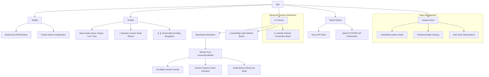
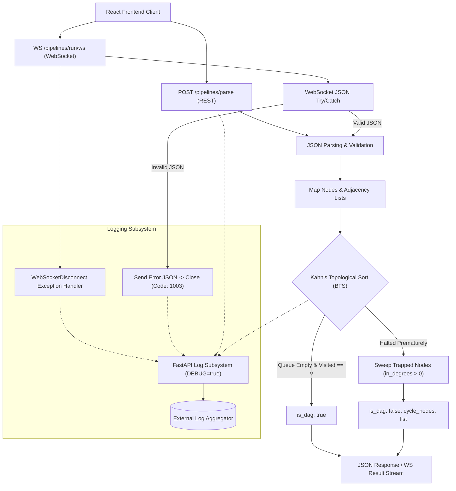

# VectorShift Workflow Pipeline Platform

A modern, high-performance, and visual node-editing workflow canvas built using React, React Flow, and Zustand on the frontend, integrated with a FastAPI Python server on the backend. This platform supports dynamic handle generation, automated cycle detection, and a dual-transport validation pipeline.

---

## 1. System Architecture & Flows

The project is structured as a monorepo consisting of isolated frontend and backend modules coordinated by an API orchestration layer.

### Frontend Component Architecture



### Backend Parsing & Validation Pipeline



---

## 2. Core Architectural Decisions

### A. Kahn's Algorithm (BFS) vs. 3-State DFS
To validate the graph's structure, this project uses **Kahn's Algorithm (BFS-based Topological Sort)** over recursive Depth-First Search (DFS) for three reasons:
1. **Recursion Safety:** In Python, recursive algorithms have a default execution call-stack limit of `1000`. Linear pipeline structures exceeding 1000 nodes will crash the server with a `RecursionError`. Kahn’s algorithm runs iteratively using a queue, avoiding recursion limits completely.
2. **Cycle Isolation:** When Kahn's algorithm halts because no nodes have a remaining in-degree of `0`, the nodes that were not traversed form part of a cycle. By sweeping the residual in-degree map, the backend extracts the exact `cycle_nodes` and sends them to the client to highlight looping elements in red.
3. **Execution Readiness:** Real-world pipeline processing engines require a topological sort order to run independent tasks in parallel and sequential tasks in order. Kahn's algorithm yields this execution sequence naturally.

### B. Hybrid Auto-Shifting API Transport Strategy
To optimize performance, the frontend automatically routes submissions based on complexity:
* **Stateless REST HTTP POST (`<= 15` nodes):** Minimizes connection setup overhead, executing validations fast over traditional HTTP.
* **Stateful WebSockets (`> 15` nodes):** For massive graphs, the client shifts to a WebSocket stream (`ws://localhost:8000/pipelines/run/ws`). This handles complex calculations without HTTP gateway timeout limits.
* **Payload Optimization:** Before transmission, the client strips non-structural attributes (like coordinates, styling, labels) to send only `{id}` and `{source, target}`, saving network bandwidth.

### C. Explicit Connection Architecture (BaseNode)
To prevent the visual flickering and "jitter" common in standard drag-to-connect nodes, this project implements an **Explicit Connection Flow**:
1. When a node is selected, a connection button `(+)` appears in its header.
2. Clicking it switches the node to `connectionMode = 'source'` and renders a scrollable overlay showing its output handles.
3. While a connection is pending, hovering over another node switches the target to `connectionMode = 'target'`, showing its available input handles in an overlay.
4. Clicking a handle completes the connection and clears the overlay state.

### D. Targeted Undo/Redo History Stack
This project implements a custom history stack (`past`, `future` arrays) in Zustand. Crucially, the history **selectively ignores dragging coordinates events** and only captures **structural events** (adding nodes, deleting nodes, adding/updating edges, or changing text). This prevents node dragging from bloating memory and flooding the undo history.

---

## 3. Implemented Features & Complexity Analysis

| Feature Name | Operation | Time Complexity | Space Complexity | Details / Rationale |
| :--- | :--- | :--- | :--- | :--- |
| **Topological Sort & Cycle Check** | Validate graph structure | $O(V + E)$ | $O(V + E)$ | Kahn's Algorithm. Traverses every vertex ($V$) and edge ($E$). Builds adjacency maps iteratively. |
| **Cycle Pinpointing** | Identify cycle nodes | $O(V)$ | $O(V)$ | Sweeps the remaining elements of the `in_degree` map to collect nodes with `in_degree > 0`. |
| **Dynamic Handle Spawning** | Text variable extraction | $O(N)$ | $O(U)$ | Evaluates text changes against a regex. Spawns handles on the left. $N$ is text length, $U$ is unique variables. |
| **Orphaned Edge Cleanup** | Purge disconnected wires | $O(E)$ | $O(1)$ | Sweeps and removes edges whose target handles no longer exist in the node's variable array. |
| **Selective Undo/Redo Stack** | Manage action history | $O(1)$ push/pop | $O(H \times (V + E))$ | Deep copies structural changes only (maximum capacity of $H = 50$ historical states). |
| **Canvas Auto-Recovery** | `localStorage` sync | $O(V + E)$ | $O(V + E)$ | Debounced state serialization. Automatically recovers work if the browser is closed or refreshed. |
| **Dynamic Custom Node Wizard** | Create user nodes | $O(1)$ | $O(F)$ | Renders custom templates dynamically based on input fields ($F$) configured by the user. |

---

## 4. Phase-Wise Development Breakdown

* **Phase 1: Environment & Specification Bootstrapping**
  Established project directories, configuration files, and unified specification schemas (`module-spec.md`, `graph.md`, and `README.md`) inside both frontend and backend modules to set clean boundaries.
* **Phase 2: Backend Module Development**
  Built the FastAPI server, registered the CORSMiddleware, and coded the graph parsing logic alongside 15 test suites validating DAG conditions, cycles, self-loops, and disjoint structures.
* **Phase 3: Frontend Module Core & Styling**
  Engineered the `BaseNode.js` abstraction wrapper. Reorganized visual rendering using CSS, modern dark background layout variables, and custom orthogonal connection lines.
* **Phase 4: Frontend Custom Nodes**
  Constructed five custom demonstration nodes (API Request, Database Query, Python Code, Classifier, Merge). Designed and registered unique inline SVG icons, and implemented the dynamic custom node template creator wizard.
* **Phase 5: Frontend Advanced Text Logic**
  Implemented dynamic resize sizing for the `TextNode.js` textarea (Binary Sizing: `40px` -> `200px`). Integrated double-curly-bracket variables `{{ variable }}` regex parsing and handle spawning, and resolved race conditions by implementing atomic store-level edge cleanups.
* **Phase 6: Frontend Integration, Submit Modal & Verification**
  Created the custom `<SubmitModal>` results overlay. Programmed the hybrid HTTP POST and WebSocket auto-shifting routing logic, wrote frontend tests, and verified the entire monorepo.

---

## 5. How to Run the Project

### Prerequisites
* Node.js (version 18 or later)
* Python 3.10 or later

### Running the Backend Server
1. Navigate to the backend directory:
   ```bash
   cd modules/backend
   ```
2. Install dependencies:
   ```bash
   pip install -r requirements.txt
   ```
3. Start the FastAPI server using Uvicorn:
   ```bash
   uvicorn main:app --reload --port 8000
   ```
The backend will run at `http://localhost:8000`.

### Running the Frontend Client
1. Navigate to the frontend directory:
   ```bash
   cd modules/frontend
   ```
2. Install the node packages:
   ```bash
   npm i
   ```
3. Start the React development environment:
   ```bash
   npm start
   ```
The client dashboard will open at `http://localhost:3000`.

---

## 6. How to Run the Test Orchestrator

The project includes an automated test orchestrator that runs both backend Python tests (via `pytest`) and frontend React tests (via Jest) recursively.

From the root directory of the workspace, run:
```bash
./tests/run_all.sh
```

### Verified Test Coverage
* **Backend Tests (`test_main.py`):** 15 tests covering basic health endpoints, empty graphs, sequential chain DAGs, multi-node loops, self-loops, disjoint graphs, and WebSocket message parsing.
* **Frontend Tests (`workflow.test.js`):** 4 tests validating node creation, selection-based height updates on text node boxes, variable handle rendering/cleanup, and automatic HTTP/WebSocket dispatcher switching.
