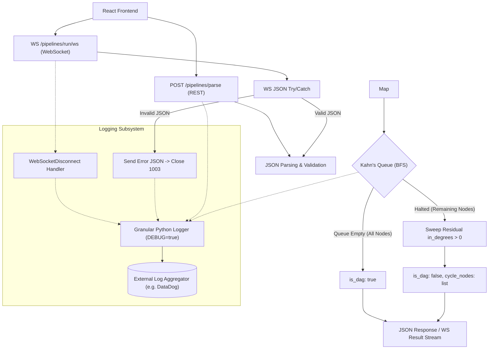

# Module Dependency Graph: Backend

```mermaid
graph TD
    Client["React Frontend"] --> API["POST /pipelines/parse (REST)"]
    Client --> WS["WS /pipelines/run/ws (WebSocket)"]
    
    API --> Parse["JSON Parsing & Validation"]
    WS --> WSParse["WS JSON Try/Catch"]
    
    WSParse -- "Invalid JSON" --> WS1003["Send Error JSON -> Close 1003"]
    WSParse -- "Valid JSON" --> Parse
    
    Map --> Kahn{"Kahn's Queue (BFS)"}
    
    Kahn -- "Queue Empty (All Nodes)" --> DAG[is_dag: true]
    Kahn -- "Halted (Remaining Nodes)" --> Sweep["Sweep Residual in_degrees > 0"]
    Sweep --> Cycle[is_dag: false, cycle_nodes: list]
    
    DAG --> Response["JSON Response / WS Result Stream"]
    Cycle --> Response
    
    WS -.-> WSDrop["WebSocketDisconnect Handler"]

    subgraph Logging Subsystem
        Logger["Granular Python Logger (DEBUG=true)"] --> Aggregator[("External Log Aggregator (e.g. DataDog)")]
        WSDrop -.-> Logger
        WS1003 -.-> Logger
    end
    API -.-> Logger
    Kahn -.-> Logger
```
